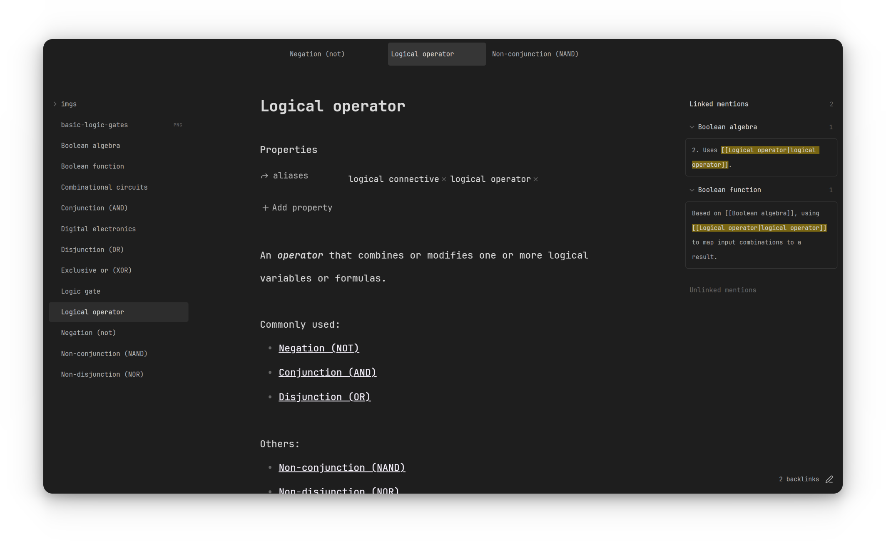

<h3 align="center">
  <strong>NOTHING</strong>
</h3>

&nbsp;

  <i>
    A theme out of nothing 
  </i>

     
    Obsidian Theme Nothing

&nbsp;

&nbsp;

### Feedback & Contribution

This is my minimalist theme for Obsidian. It's designed to be minimal(?) by all the ways.

If you find a bug or have a suggestion to make it even more "nothing", please **open an issue**! 

&nbsp;

&nbsp;

<i>Build with ❤️ by <strong>ForeverWeLearn</strong></i>

